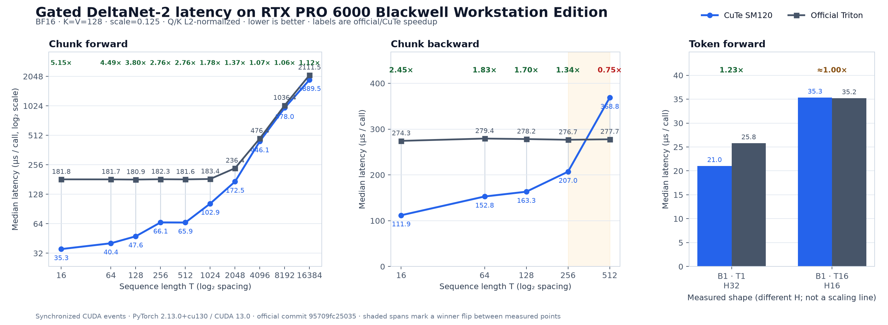

# gdn2-sm120

SM120-specialized [CuTe DSL](https://docs.nvidia.com/cutlass/latest/media/docs/pythonDSL/overview.html)
kernels for [Gated DeltaNet-2](https://arxiv.org/abs/2605.22791), developed and
measured on an NVIDIA RTX PRO 6000 Blackwell Workstation Edition.

The repository contains three working CUDA paths:

- BT=16 compact-WY chunkwise forward with SM120 warp MMA and a specialized
  algebraic pipeline for long BF16 prefill;
- a checkpointed training backward that dispatches between short recurrence,
  chunk-parallel recurrence, and compact-WY warp-MMA VJPs;
- a register-resident token/recurrent forward for decoding.

All three are written in CuTe DSL, compile specifically for `sm_120`, use the
active PyTorch CUDA stream, and cache TVM-FFI executors after the first JIT
compilation. A PyTorch `autograd.Function` connects the chunk forward and
backward kernels.

## Quick start

The project and its lockfile are managed with
[`uv`](https://docs.astral.sh/uv/). Python 3.12 is pinned in
`.python-version`.

```bash
uv sync --locked
uv run python -m gdn2_sm120.env
CUTE_DSL_ARCH=sm_120 uv run python -m gdn2_sm120.smoke
uv run pytest -q
```

Install the additional official-baseline dependencies with:

```bash
uv sync --locked --all-groups
```

The first call for a new static chunk/backward shape performs JIT compilation;
benchmark and production warm paths reuse an in-process compiled executor.

## API

The optimized specialization accepts contiguous, 16-byte-aligned tensors.
Sequence tensors use `[batch, time, heads, 128]` layout. Q/K/V/erase/write
tensors use BF16 or FP16, log-decay `g` may use FP32, and state tensors use FP32
`[batch, heads, 128, 128]`. The output scale defaults to `1/sqrt(128)`.

```python
from gdn2_sm120 import chunk_gdn2, recurrent_gdn2

# Training: backward() selects the native CuTe schedule by sequence length.
output, final_state = chunk_gdn2(
    q,
    k,
    v,
    g,
    beta,
    w,
    initial_state,
    output_final_state=True,
)
loss = output.float().square().mean() + final_state.square().mean()
loss.backward()

# Decoding or short recurrent evaluation: forward-only.
output, final_state = recurrent_gdn2(q, k, v, g, beta, w, initial_state)
```

The primitive expects already-activated erase/write gates and log-decay.
Q/K L2 normalization, gate projections, grouped-value head expansion, packed
variable-length sequences, and fused gate activation are not yet part of this
first specialization. Unsupported devices and shapes fail explicitly; there
is no silent fallback.

For gradient-enabled calls of 64 tokens or more, the forward saves exact FP32
states at every BT=16 boundary. Backward uses those checkpoints instead of
inverting the complete sequence from a rounded final state. At 128 tokens and
above it dispatches to a compact-WY tensor-core VJP; partial final chunks are
supported. Forward-only calls do not allocate these training checkpoints.

## Benchmark against the official Triton implementation

The benchmark loader pins the official repository to commit
`95709fc250357c2dd109361c353192f2aa5913f9` and refuses another commit unless
explicitly overridden. The compatible Flash Linear Attention dependency is
also commit-pinned in `uv.lock`.

```bash
git clone https://github.com/NVlabs/GatedDeltaNet-2.git /tmp/GatedDeltaNet-2
git -C /tmp/GatedDeltaNet-2 checkout 95709fc250357c2dd109361c353192f2aa5913f9

uv run gdn2-sm120-bench \
  --mode chunk-forward --batch 1 --time 16 --heads 16 --dtype bf16 \
  --official-repo /tmp/GatedDeltaNet-2
uv run gdn2-sm120-bench \
  --mode chunk-backward --batch 1 --time 16 --heads 16 --dtype bf16 \
  --official-repo /tmp/GatedDeltaNet-2
uv run gdn2-sm120-bench \
  --mode chunk-training --batch 1 --time 256 --heads 16 --dtype bf16 \
  --official-repo /tmp/GatedDeltaNet-2
uv run gdn2-sm120-bench \
  --mode token-forward --batch 1 --time 1 --heads 32 --dtype bf16 \
  --official-repo /tmp/GatedDeltaNet-2
```

Latency excludes compilation and Triton autotuning. Both implementations use
the same pre-normalized Q/K, FP32 state and log-decay, output scale, public
Python/autograd call boundary, warmup count, and CUDA-event measurement. An
untimed check compares outputs, state, or all gradients before timing. See
[`docs/benchmarks.md`](docs/benchmarks.md) for the measured matrix and caveats.



The figure is generated from the tracked, validated
[`docs/data/benchmark-results-sm120.json`](docs/data/benchmark-results-sm120.json)
suite. Regenerate it without installing the official benchmark stack:

```bash
uv run --group visualization gdn2-sm120-plot \
  docs/data/benchmark-results-sm120.json \
  --output docs/assets/benchmark-results-sm120.png
```

Representative BF16 medians on the target workstation are:

| Path | Shape | CuTe SM120 | Official Triton | Speedup |
|---|---:|---:|---:|---:|
| chunk forward | B1 T16 H16 | 35.3 us | 181.8 us | **5.15x** |
| chunk forward | B1 T512 H16 | 65.9 us | 181.6 us | **2.76x** |
| chunk forward | B1 T2048 H16 | 172.5 us | 236.4 us | **1.37x** |
| chunk forward | B1 T16384 H16 | 1889.5 us | 2111.5 us | **1.12x** |
| chunk backward | B1 T16 H16 | 111.9 us | 274.3 us | **2.45x** |
| chunk backward | B1 T256 H16 | 207.0 us | 276.7 us | **1.34x** |
| token forward | B1 T1 H32 | 21.0 us | 25.8 us | **1.23x** |

## Why FROST is not copied directly

The cuDNN Frontend FROST GDN2 kernel is an important scheduling reference, but
its current prefill design uses 16 warps, about 205 KiB of shared memory,
Tensor Memory, and `tcgen05` instructions for the SM100/SM103 family. SM120 is
a distinct Blackwell family: the RTX PRO 6000 path instead uses register
accumulators, warp shuffles, value/key partitioning, and
`MmaF16BF16Op` warp MMA. The forward state scan and the long-sequence backward
therefore use a schedule designed for SM120 rather than a direct FROST port.

The implementation is independently derived from the paper's equations. No
source from the official GDN2 repository (NVIDIA Source Code License-NC) is
vendored or copied. FROST and CUTLASS are referenced at fixed revisions in
[`docs/design.md`](docs/design.md).

## Project status

This is an alpha, shape-specialized kernel project rather than a drop-in
replacement for every official option. The primary production shape
`K=V=128` is implemented and numerically checked in BF16/FP16, including FP32
log-decay, optional initial state, final-state VJPs, empty recurrent sequences,
and non-default CUDA streams. In the measured B1/H16 BF16 sweep, chunk forward
remains faster than the official path at every sampled length through T=16384;
backward-only is faster through T=256. At T=512, backward-only is slower, while
the measured combined forward+backward call remains 1.25x faster because the
forward path is much faster. The checkpointed path trades memory for speed: its
T512 measured peak allocation delta is about 132 MiB versus 70 MiB for the
official path. Additional dimensions, packed sequences, and reducing the T512
backward workspace/launch count remain optimization work.

Licensed under Apache-2.0. See [`LICENSE`](LICENSE).
